# Function Mapping & Performance Analysis

## Executive Summary

This document maps all functions, edge functions, and modules in the codebase, identifying performance hotspots, duplicate logic, and optimization opportunities.

## Critical Performance Hotspots 🔥

### Database Access Patterns
1. **`getOrgId()` - EXTREME HOTSPOT** 🔥🔥🔥
   - Called in nearly EVERY function
   - 2 DB queries per call (auth.getUser + users table lookup)
   - **Impact**: 346+ calls across codebase
   - **Optimization**: Cache org_id in context/session

2. **`getUnifiedDashboardData()` - HIGH HOTSPOT** 🔥🔥
   - Complex multi-query aggregation
   - Called on every dashboard/prompts page load
   - **Queries**: 4-6 parallel DB calls + RPC functions
   - **Performance**: 500-2000ms typical response

3. **`get_latest_prompt_provider_responses_catalog_only` RPC** 🔥
   - Complex SQL with CTEs and JSON operations
   - Called frequently for prompt details
   - **Performance**: Window functions + JSON processing

## Edge Functions

### High-Traffic Functions
| Function | Purpose | Inputs | Outputs | Hotspot Level |
|----------|---------|---------|---------|---------------|
| `analyze-ai-response` | LLM response analysis | `{prompt_id, raw_response, provider}` | `{score, competitors, org_brand_present}` | 🔥🔥 High |
| `run-prompt-now` | Immediate prompt execution | `{prompt_id, providers[]}` | `{results[], job_id}` | 🔥🔥 High |
| `robust-batch-processor` | Batch job processing | `{job_id, resume?}` | `{progress, status}` | 🔥 Medium |
| `suggest-prompts-now` | AI prompt generation | `{org_context}` | `{suggestions[]}` | 🔥 Medium |

### Background/Scheduled Functions
| Function | Purpose | Trigger | DB Impact |
|----------|---------|---------|-----------|
| `daily-batch-trigger` | Daily processing coordinator | Cron | High - spawns multiple jobs |
| `weekly-suggestions` | Weekly prompt suggestions | Cron | Medium - LLM + DB writes |
| `audit-visibility` | Data quality checks | Manual/Cron | Low - read-only analysis |

## Core Library Functions

### Data Fetching Layer
```typescript
// CRITICAL PATH - Called on every page load
getUnifiedDashboardData(): Promise<UnifiedDashboardData>
├── getOrgId() - 🔥🔥🔥 EXTREME HOTSPOT (2 DB queries)
├── supabase.from("prompts").select() - 🔥🔥 Large result sets
├── supabase.from("llm_providers").select() - 🔥 Small but frequent
├── supabase.from('prompt_provider_responses') - 🔥🔥 30-day window
└── supabase.rpc('get_latest_prompt_provider_responses_catalog_only') - 🔥🔥 Complex

getUnifiedPromptData(): Promise<UnifiedPromptData>
├── getUnifiedDashboardData() - 🔥🔥 Inherits all above hotspots
├── supabase.rpc('get_prompt_visibility_7d') - 🔥 Aggregation RPC
└── Complex in-memory processing - 🔥 CPU intensive
```

### Authentication & Authorization
```typescript
// EXTREME HOTSPOT - Called everywhere
getOrgId(): Promise<string>
├── supabase.auth.getUser() - Network call
└── supabase.from("users").select() - DB lookup

// Used in edge functions
getUserOrgId(supabase): Promise<string>
├── Similar pattern to getOrgId()
└── Used in ALL edge functions
```

## React Components - Render Hotspots

### Heavy Rendering Components
| Component | Render Complexity | React Hooks | DB Calls | Optimization Needed |
|-----------|------------------|-------------|----------|-------------------|
| `PromptList` | 🔥🔥🔥 EXTREME | `useMemo` for filtering | Multiple via props | Virtual scrolling for 100+ prompts |
| `Dashboard` | 🔥🔥 HIGH | `useEffect` chains | `getUnifiedDashboardData()` | Skeleton loading, data pre-fetching |
| `ProviderResponseCard` | 🔥🔥 HIGH | Multiple `useState` | None direct | Memoize heavy JSON parsing |
| `CompetitorCatalog` | 🔥 MEDIUM | `useEffect` + `useState` | Direct supabase calls | Pagination for large catalogs |

### Hook Usage Patterns
```typescript
// FREQUENT PATTERN - High re-render risk
const [loading, setLoading] = useState(true);
const [data, setData] = useState([]);
const [error, setError] = useState(null);

useEffect(() => {
  // Often missing dependency arrays or too broad dependencies
  fetchData();
}, []); // ⚠️ Missing dependencies common
```

## Database Functions Analysis

### RPC Functions (Performance Critical)
```sql
-- EXTREME HOTSPOT - Complex window functions
get_latest_prompt_provider_responses_catalog_only(p_prompt_id, p_org_id)
├── Window functions: ROW_NUMBER() OVER (PARTITION BY...)
├── JSON aggregation: jsonb_agg(competitor_name)
├── Multiple CTEs and joins
└── Called per prompt detail view

-- HIGH USAGE - Dashboard metrics
get_prompt_visibility_7d(requesting_org_id)
├── Aggregation: COUNT(), AVG()
├── 7-day time window filtering
└── Called for dashboard summaries

-- BACKGROUND HEAVY - Cleanup operations
fix_brand_classification_all_providers()
├── Loops through all responses
├── JSON manipulation per row
├── Bulk updates
└── Can process thousands of rows
```

## Duplicate Logic Identified

### 1. Org ID Fetching - CRITICAL DUPLICATION
```typescript
// Pattern repeated 50+ times:
const orgId = await getOrgId();
const { data, error } = await supabase
  .from("table")
  .select()
  .eq("org_id", orgId);
```
**Optimization**: Create HOC or hook for org-scoped queries

### 2. Loading State Management
```typescript
// Repeated pattern in 20+ components:
const [loading, setLoading] = useState(true);
const [data, setData] = useState([]);
const [error, setError] = useState(null);

// Could be: useAsyncData hook
```

### 3. Provider Response Processing
```typescript
// Similar processing logic in multiple files:
- src/lib/data/unified-fetcher.ts (lines 287-296)
- src/components/ProviderResponseCard.tsx 
- src/pages/Dashboard.tsx
```

### 4. Competitor Validation
```typescript
// Duplicate validation logic:
- supabase/functions/_shared/enhanced-competitor-detector.ts
- supabase/functions/_shared/competitor-detection/strict-detector.ts
- src/components/CompetitorChip.tsx (isValidCompetitor)
```

## Dead/Unused Exports

### Deprecated Files (Marked for Removal)
```typescript
// src/lib/prompts/data-with-scores.ts - DEPRECATED
export async function getPromptsWithScores() // ❌ Unused

// src/lib/prompts/provider-data.ts - DEPRECATED  
export async function getPromptsWithProviderData() // ❌ Unused
export async function getOrgCompetitorSummary() // ❌ Unused
```

### Potentially Unused Utilities
```typescript
// src/lib/time.ts - Check usage
export function formatTimeAgo() // ⚠️ Verify usage

// src/components/CompetitorChip.tsx
export { isValidCompetitor }; // ⚠️ Only used in same component
```

## Network/API Call Patterns

### LLM API Calls (High Latency)
```typescript
// supabase/functions/_shared/providers.ts
extractBrandsOpenAI(promptText, apiKey) // 2-5s response time
extractBrandsGemini(promptText, apiKey)  // 1-3s response time
extractBrandsPerplexity(promptText, apiKey) // 3-8s response time
```

### External Service Calls
```typescript
// Background services - can timeout
backgroundPreloader.preloadCriticalData() // Multi-service coordination
cacheEventManager.invalidatePattern() // Redis operations
```

## Call Site Analysis

### Most Called Functions (Execution Frequency)
1. **`getOrgId()`** - 346+ call sites across entire codebase
2. **`supabase.from()`** - 200+ database queries  
3. **`useState()`** - 243+ React state declarations
4. **`useEffect()`** - 180+ effect hooks
5. **`isFeatureEnabled()`** - 50+ feature flag checks

### Heavy Loop Operations
```typescript
// src/lib/data/unified-fetcher.ts (lines 299-338)
prompts.map(prompt => {
  // Complex per-prompt processing
  const promptResponses = validResponses.filter(r => r.prompt_id === prompt.id);
  // Multiple array operations per prompt
});

// supabase/functions/_shared/enhanced-competitor-detector.ts
for (const brand of brandCatalog) {
  // Gazetteer building - O(n) with nested operations
}
```

## Optimization Recommendations

### Immediate (High Impact, Low Risk)
1. **Cache org_id in AuthContext** - Eliminate 346+ redundant DB calls
2. **Add React.memo to heavy components** - Reduce unnecessary re-renders
3. **Implement data preloading** - Use existing background-preloader
4. **Add loading skeletons** - Improve perceived performance

### Medium Term
1. **Database query optimization** - Add indexes for hot queries
2. **Implement virtual scrolling** - For large prompt lists
3. **Batch API calls** - Reduce network roundtrips
4. **Add response caching** - Redis for frequently accessed data

### Long Term
1. **Create unified query layer** - Eliminate duplicate fetching logic
2. **Implement real-time subscriptions** - Reduce polling
3. **Add comprehensive caching strategy** - Multi-level cache hierarchy
4. **Optimize RPC functions** - Rewrite complex SQL procedures

## Call Graph Hot Paths

```mermaid
graph TD
    A[User loads /prompts] --> B[getUnifiedDashboardData]
    B --> C[getOrgId - 🔥🔥🔥]
    B --> D[4-6 DB queries - 🔥🔥]
    B --> E[Complex processing - 🔥]
    
    F[User clicks prompt] --> G[PromptRow expand]
    G --> H[getLatestResponses - 🔥🔥]
    H --> C
    
    I[Background jobs] --> J[analyze-ai-response - 🔥🔥]
    J --> K[LLM API calls - 🔥]
    J --> L[Competitor detection - 🔥]
```



---
*Generated on 2025-08-31. Update as codebase evolves.*